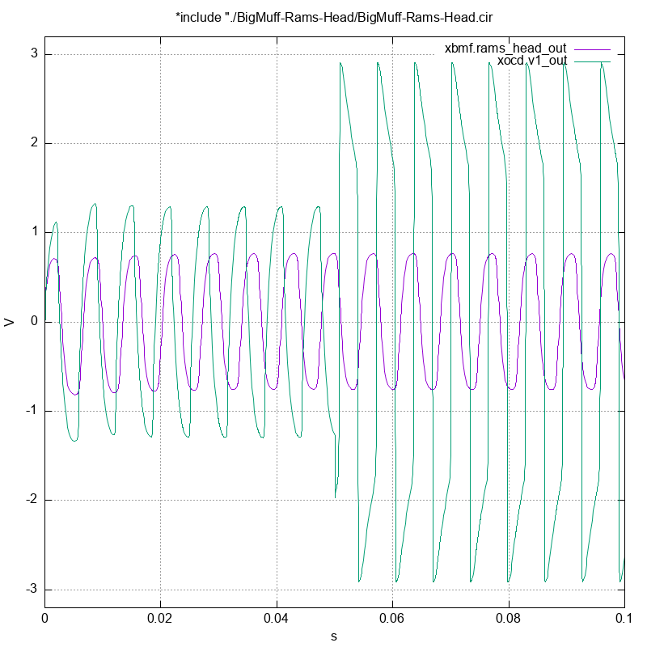

SPICE Sims
==========

Most of these should be subcircuits so you can instantiate and
compare, like so:

```
.include "./BigMuff-Rams-Head/BigMuff-Rams-Head.cir"
.include "./Fulltone-OCD-V1-KC8/Fulltone-OCD-V1.cir"
.tran 250u 100m

xbmf BigMuff-Rams-Head
xocd Fulltone-OCD-V1

.control

set spicebehavior=all
run
display
set gnuplot_terminal = png/quit

gnuplot comparison
+ xbmf.rams_head_out
+ xocd.v1_out

.endc
```

And then: `ngspice -b ./contrast.cir` to compare the two:


